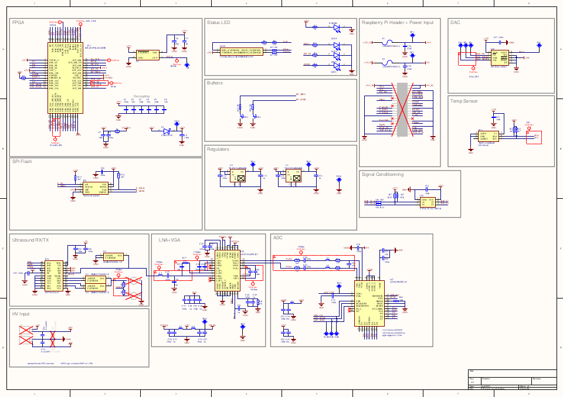
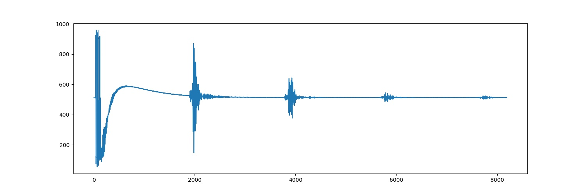

 

# the up5k lit3rick open hardware ultrasound pulse echo board, 100dB gain

# OSHWA certified ! 

[https://certification.oshwa.org/fr000016.html](https://certification.oshwa.org/fr000016.html)

## Presentation of the hardware

* Lattice: up5k. Onboard RAM for 64k points saves.
* Onboard flash : W25X10CLSNIG
* Pulser : HV7361GA-G: adaptable to +-100V pulses. Onboard is 5V pulse.
* AD8332 for gain
* ADC: 10bits, reaching 64Msps here
* DAC: MCP4812-E/MS for 8us gain segments

* [Schematics](/altium/OUTPUT/Schematics/ice40_schematic.PDF)

# Pics

## Design 

## Prod

## Python user code

* Principles are [here](/lit3-32/icestudio/Readme.md)
* Python code is [here](/icestudio/python/python.py)

## Verilog: using icestudio (work in progress)

# Outputs

Below are echoes from a 5V pulse, gain at 350/1000, HILO being low.

# License

This work is based on two previous TAPR projects, [the echOmods project](https://github.com/kelu124/echomods/), and the [un0rick project](https://github.com/kelu124/un0rick) - its boards are open hardware and software, developped with open-source elements as much as possible.

Copyright Kelu124 (kelu124@gmail.com) 2021.

* The hardware is licensed under TAPR Open Hardware License (www.tapr.org/OHL)
* The software components are free software: you can redistribute it and/or modify it under the terms of the GNU General Public License as published by the Free Software Foundation, either version 3 of the License, or (at your option) any later version.
* The documentation is licensed under a [Creative Commons Attribution-ShareAlike 3.0 Unported License](http://creativecommons.org/licenses/by-sa/3.0/).

## Disclaimer

This project is distributed WITHOUT ANY EXPRESS OR IMPLIED WARRANTY, INCLUDING OF MERCHANTABILITY, SATISFACTORY QUALITY AND FITNESS FOR A PARTICULAR PURPOSE. 

