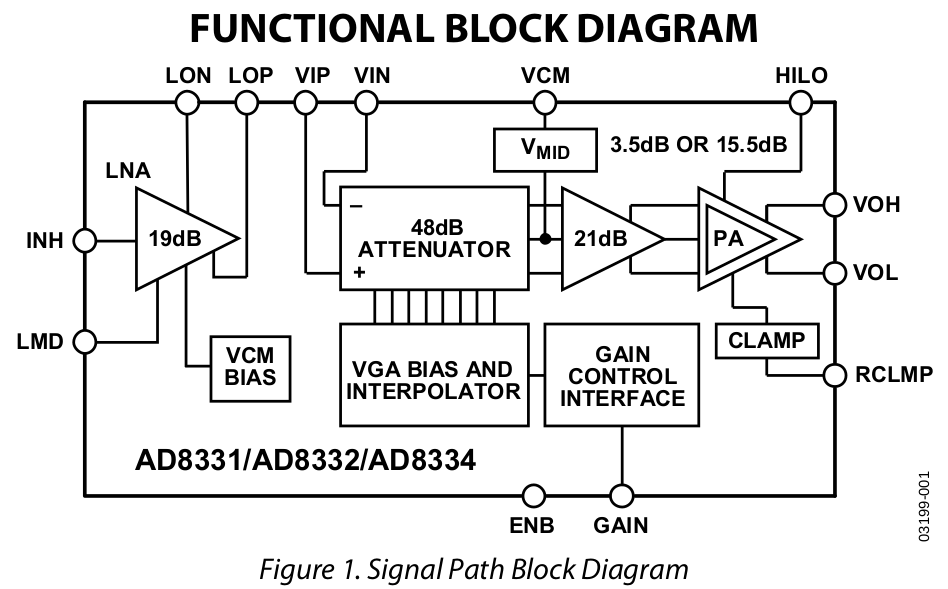
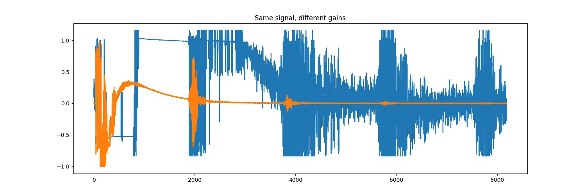
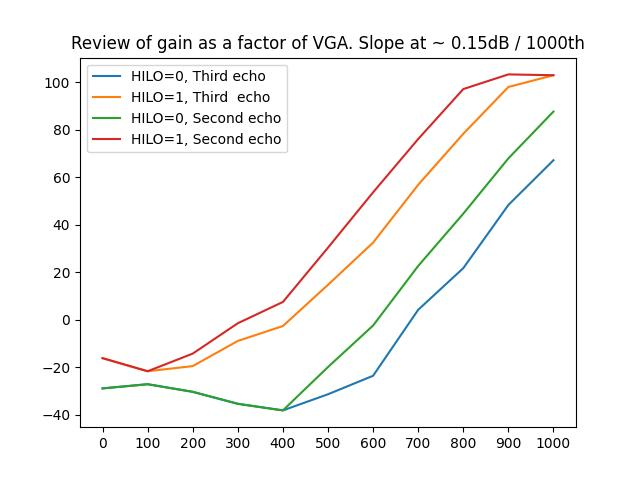
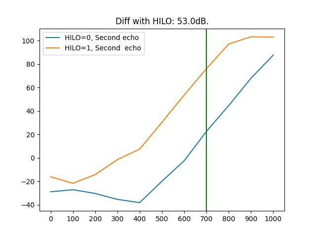

# What gain range for the board ?

* Total: HI: -4dB to 92dB amp
* Total: LO: -28dB to 68dB amp

## Datasheet

* [Datasheet](ad8332/AD8331_8332_8334.pdf)

## Range

* LNA: +19dB
* Per channel:
  * -48db - 0dB attenuation
  * 21dB fixed gain
  * 3.5 or 15.5 dB variable gain (HI/LO) (12dB diff)

### Gains cf datasheet

Wide gain range with programmable postamp
* −4.5 dB to +43.5 dB in LO gain mode
* 7.5 dB to 55.5 dB in HI gain mode

# Acqs from [20320114 Tests](../20230114_GainTests/)

## Acquisitions

## Plots

__Range of 140dB as ADC is 10 bits, `~20*np.log(1024) = 138`__

