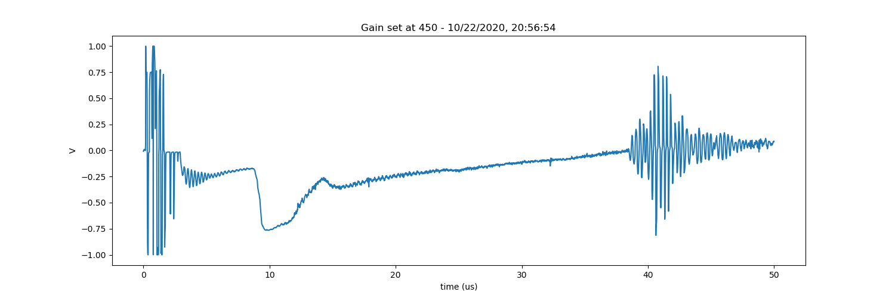
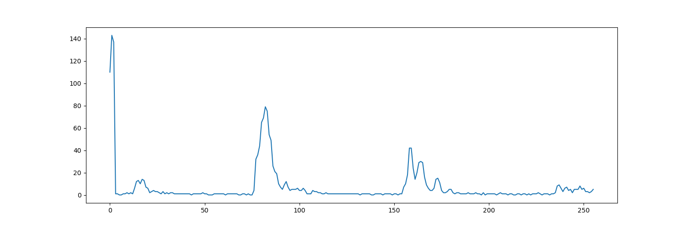
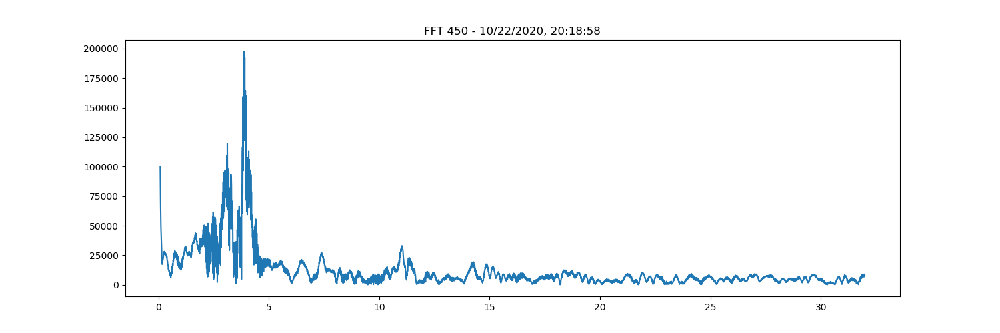

# NDT example

This is the [reference file](ndt.py). Staying in the py_fpga folder, that's operated with

```
https://raw.githubusercontent.com/kelu124/lit3rick/master/py_fpga/ndt.py
python3 ndt.py
```

## Initiating the object

```python
    # Starting an object 
    fpga = py_fpga(i2c_bus=i2c_bus, py_audio=p, spi_bus=spi)
    # Setting up the pulse - PHV time for duration of positivepulse
    fpga.set_waveform(pdelay=1, PHV_time=30, PnHV_time=30, PDamp_time=5)
```

The last line ways 1 clock after ADC starts, keeps HV positive on during 30 cycles, waits 1 clock, keeps HV negative on during 30 cycles (normally GND), then the damper is put for 5 cycles. 

## Setting the gain

```python
    startVal,nPtsDAC = 450, 16
    for i in range(nPtsDAC):
        fpga.set_dac(int(startVal + (i*(511-startVal))/nPtsDAC), mem=i)

    fpga.set_dac(200, mem=0)
    fpga.set_dac(450, mem=1)
    fpga.set_dac(450, mem=2)

    hiloVal = 1
    dacVal = 450
    fpga.set_HILO(hiloVal)
    fpga.set_dac(dacVal) 
```

The command `fpga.set_dac(x, mem=y)`  sets a value of x (from 0 to 511) between 8*y us and 8*y+7 us. `fpga.set_dac(dacVal)` sets the value of the DAC outside of acquisitions.


## Display of data

```python
    fpga.capture_signal() # captures the acquisition
    data = fpga.read_signal_through_spi() # reads the acquisition
    t = [x/64.0 for x in range(len(data))] # xlabels
    fig = plt.plot( t[0:64*50],data[0:64*50] ) # 64msps * 50us
```

The above prepares a zoom on the signal.



## Obtaining a filtered image

```python
    fpga.calc_fft()                        # onboard filtering calculation
    time.sleep(3/1000.0)                   # let's wait, usally takes 800ms
    fpga_fft = fpga.read_fft_through_spi() # reading filtered signal
    fig = plt.plot(fpga_fft) # normally 256 pts long, 2Msps subsampling
```
 


## Other images

### Overall


### FFT

